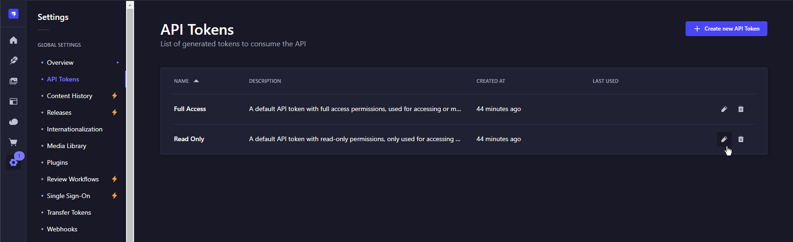
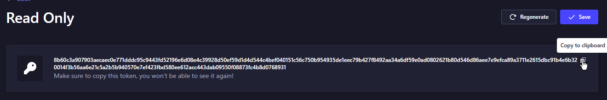

# Technical manual

This document serves as a technical guide on how to set up and run the website implementation for Bachelor thesis 'Design of an interactive website for education in the field of artificial intelligence.'

## Requirements

1.  A computer or server running an UNIX-based OS (Linux or macOS). Using Windows with WSL (Windows Subsystem for Linux) is also viable.
2.  Installed Docker Engine, for installation instructions, click [here](https://docs.docker.com/engine/install/).
3.  Installed Git, for installation instructions, click [here](https://git-scm.com/downloads).
4.  Installed Node.js 18.18 or later (recommended 20 or higher, only even number versions), for installation instructions, click [here](https://nodejs.org/en/download).
5.  At least 2 GB of RAM.
6.  At least 5 GB of storage (SSD recommended).

Note that the system resource requirements provided above are minimal. As the application grows, the necessary resources increase.

## Setup

Initially, we have to clone the repository containing the project.

```bash
git clone git@github.com:ignissak/bp-mono.git
```

First, we need to create the GitHub OAuth Application that is used for authentication for the front-end application. Instructions on how to do this can be found [here](https://docs.github.com/en/apps/oauth-apps/building-oauth-apps/creating-an-oauth-app). For proceeding further, you will need Github App ID and secret.

After creating the GitHub OAuth application, we need to edit the root environmental file.

```bash
cp .env.example .env
```

We can edit the file in any editor (e.g. vim, nano, etc.). The properties that must be changed before the initial running of the application are as follows:

```bash
APP_KEYS, API_TOKEN_SALT, ADMIN_JWT_SECRET, TRANSFER_TOKEN_SALT,
JWT_SECRET, AUTH_GITHUB_ID, AUTH_GITHUB_SECRET
```

The property `STRAPI_TOKEN` will be changed later in the setup process.

Before we can build the front-end application, we need to initialise and run the database. We can do that using this prompt:

```bash
docker compose up strapi-db -d
```

Then we need to move to the front-end application submodule and run all the database migrations. Before we can do that, we need to create an environment file and check if the credentials are correct.

```bash
cd bp-next-meta/
cp .env.example .env
```

If the credentials are correct (by default there are template credentials that will work) we can install node modules and run the migrations.

```bash
npm i
npx prisma migrate deploy
```

Now we are ready to build the front-end application image. This process may take several minutes.

```bash
cd ../
docker compose build frontend-next
```

If the build is finished we can now turn on every service in the docker compose.

```bash
docker compose up
```

Now we need to visit the website [http://localhost:1337](http://localhost:1337). On this website, we will be greeted with the Strapi setup form. We need to create an admin account here. After creating the admin account, go to Settings > API Tokens and click on the edit button for the Read Only token.



On this page, we will need to click the Regenerate button. This will regenerate the API token, and we will see the new token we need to save in our environment file.



We need to copy this token and save it inside the root environment file under the `STRAPI_TOKEN` entry.

Finally, we just need to restart the docker containers.

```bash
docker compose restart
```

### Credentials

Beware that using the default credentials supplied in the example environment file may be dangerous. Before deploying to production, change the credentials to avoid potential security breach.
